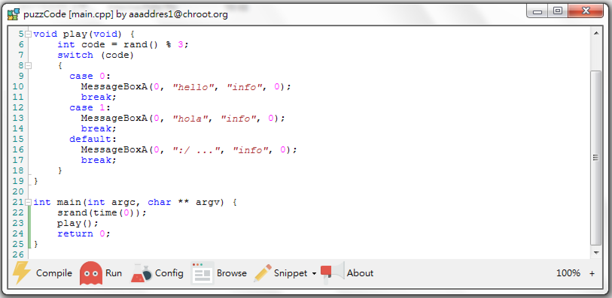
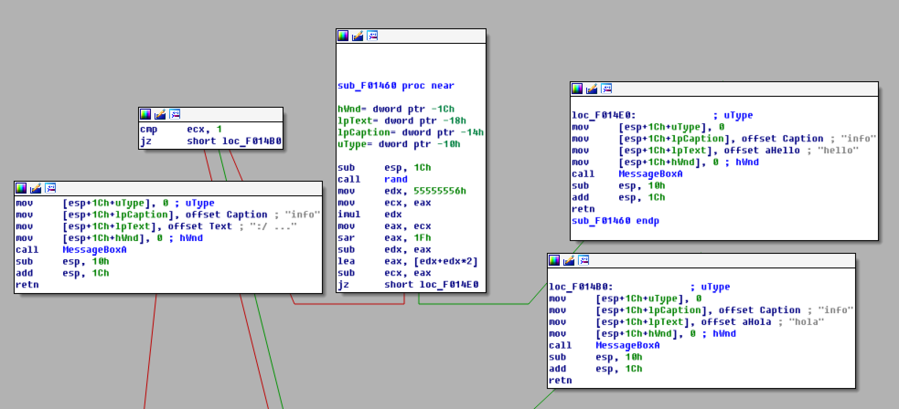
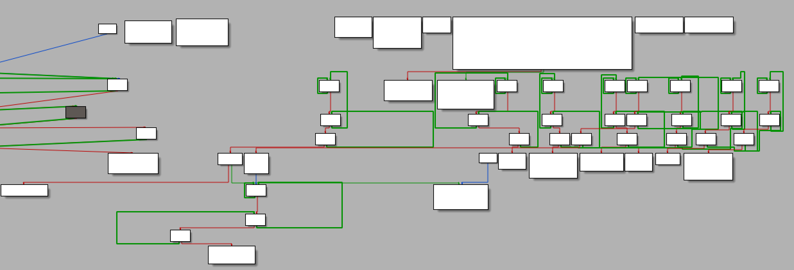
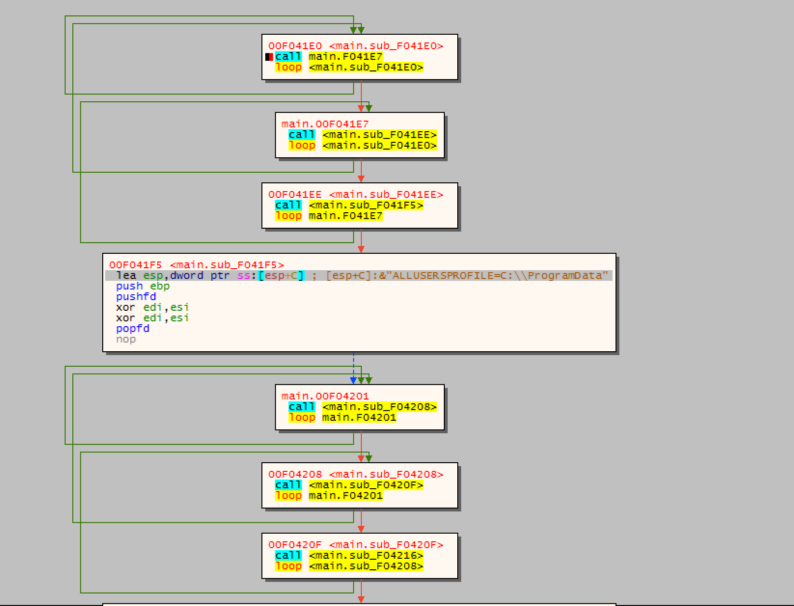
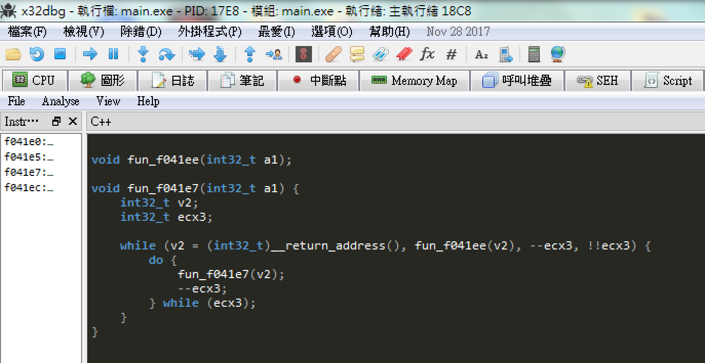
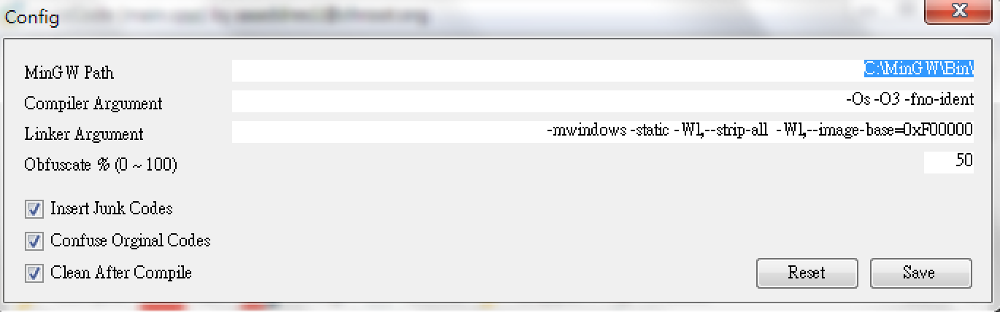
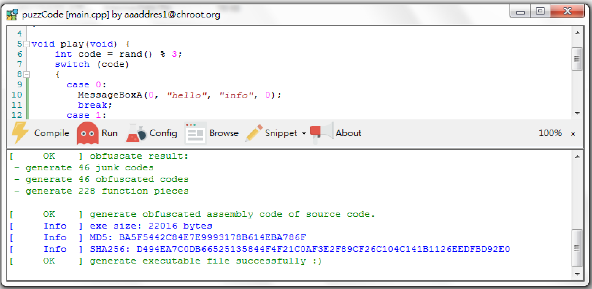
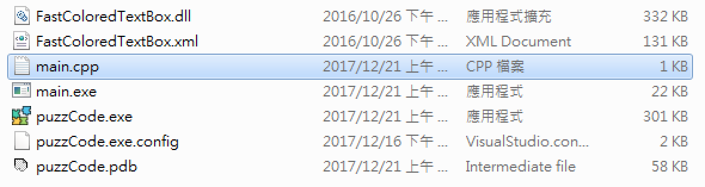
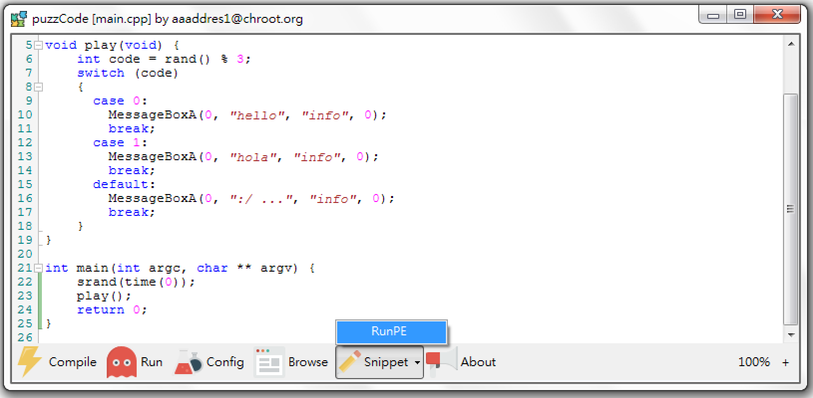
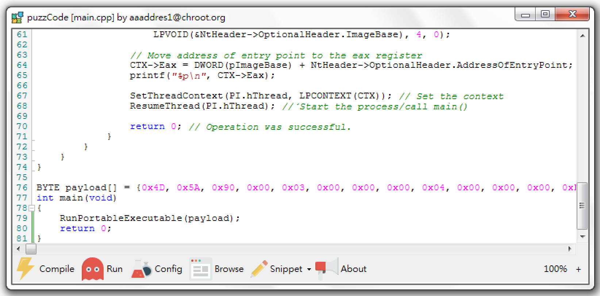

# puzzCode(Puzzle Code)



## Description

puzzCode is a simple compiler based on mingw, written in C# to build windows applications in such a way that they can’t be analysed by standard analysis tools (e.g. IDA, Ollydbg, x64dbg, Snowman Decompiler, etc.)

puzzCode is based on MinGW to compile C/C++ source code to assembly language while also obfuscating every instruction. puzzCode transforms each original instruction into obfuscated code by breaking each function into countless pieces.

**The most important thing is that the executable (exe) file, once compiled by puzzCode will be undetectable by antivirus as it effectively will create a completely new application.**

### Example

```
void play(void) {
    int code = rand() % 3;
    switch (code)
    {
      case 0:
        MessageBoxA(0, "hello", "info", 0);
        break;
      case 1:
        MessageBoxA(0, "hola", "info", 0);
        break;
      default:
        MessageBoxA(0, ":/ ...", "info", 0);
        break;
    }
}   
```

### Normal Graph Overview (IDA)

It's pretty easy to understand, right?




### Graph Overview, Compiled via puzzCode (IDA)

... How about now? :)



### x64dbg (32bit Mode)




### Snowman Plug-in



## Quick Run

puzzCode only support 32bit Windows PE compiling currently.

1. Install MinGW on your windows environment: https://sourceforge.net/projects/mingw/files/Installer

2. Download from [Release Page](https://github.com/aaaddress1/puzzCode/releases), or clone this project, compile it with Visual C# 2017, you'll get puzzCode software.

## Usage



You have to set the MinGW path on your Windows environment the first time you run puzzCode and enter compiler arguments, linker arguments, and obfuscated degree (from 0 to 100).




After you setup the configuration, you are able to freely code in puzzCode. Simply hit the "Compile" button and the .exe file will be generated at the same path of your source code file.

### Snippet


Some backdoors and programs are really useful but what if you don't have that source code? That's Ok, your can use the `Snippet > RunPE` feature.



puzzCode packs the program you selected, and generates the source code. **Just compile, and get a new undetectable Backdoooooor!!**

*RunPE refer: https://github.com/Zer0Mem0ry/RunPE/blob/master/RunPE.cpp*

